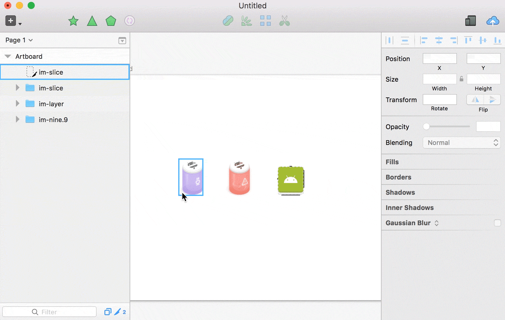

# Slicer


Your friendly Sketch slicing helper.



Read more at https://ozzik.github.io/Slicer.

## How to install
1. Download and open ```Slicer-master.zip```
2. Open ```Slicer.sketchplugin``` (Sketch will magically install the plugin)

## Wha's new
* 0.4.4 (Jun 18)
  * Adds support for Sketch 45 auto update system so y'all stop re-downloading from here
* 0.4.3 (Jan 15)
  * Fixes unwillingness of short-name layers to get exported to Android (thanks Ronit Klein!)
* 0.4.2 (Dec 8)
  * Fixes trimming of transparent pixels when exporting layers (by superhero @girafic)
* 0.4.1 (Nov 8)
  * Fixes Sketch 41 bugs (slices not being exported at all)
* 0.4.0 (Oct 9)
  * Now exporting layers using exportables for all you wild exporters (for visually ignoring everything below those layers. Slices are still being exported using, well, slices)
  * Adds "xxxhdpi" (4x) export size for Android
* 0.3.1 (Sep 26)
  * Hello world (that's a funny version number but yep)

## Notes
* Tested on Sketch 41